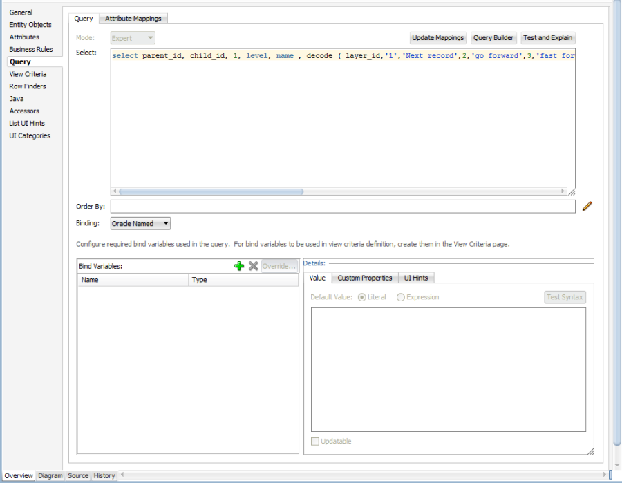
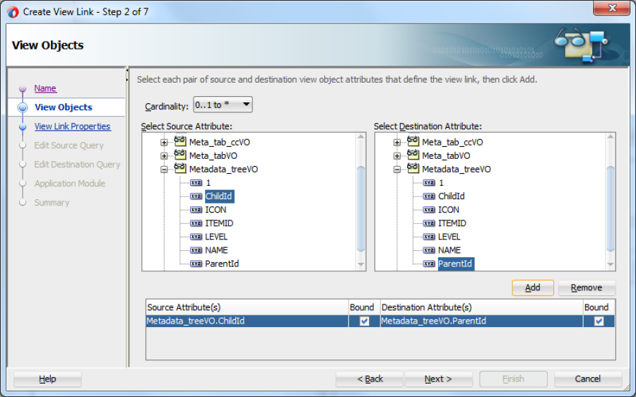
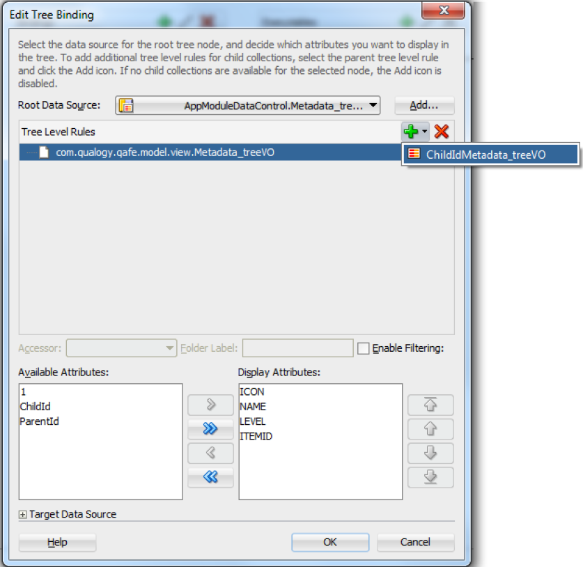

# Post Conversion Steps - Tree

## General

The following ADF artifacts will be generated when converting a tree with a record group in an Oracle Form:

1. An af:tree component will be added to the UI page (<OracleFormName><WindowName>.jsff)
2. An entry for the binding with the View Object will be added to the Page Definition (<OracleFormName><WindowName>PageDef.xml)
3. View Object (<RecordGroupName>VO.xml) is created with the query and the attributes based on the Record Group and Record Group Columns

## Find the View Object

1. Skip this step if you know the location of the view object file
2. Open the jsff page which containing an af:tree component, you can find the jsff pages in the ViewController project, inside the Web Content->pages folder
3. Go to the af:tree component and ctrl-click on the text between bindings and treeModel of the value attribute, this will open the corresponding page definition file
4. Inside the page definition, ctrl-click on the value of the IterBinding attribute of the tree element, this will lead you to the iterator element, then ctrl-click on the value of the Binds attribute, this will open the application module file
5. Inside the application module, the location of the view object is specified by the ViewObjectName attribute of the ViewUsage element, within the Model project


## Modify the View Object



Open the view object by double-clicking on the view object file, and go to the Query section of the Overview tab, the query should look like this:

```sql
  select 1
  , level
  , name
  , decode ( layer_id,'1','Next record',2,'go forward',3,'fast forward','wiz' ) icon
  , itemid item_id
  from meta_data_tree_v
  start with parent_id = 'startpoint'
  connect by parent_id = prior child_id
  order by sort_id
```

Check whether the columns mentioned in the Connect By clause are also present in the Select clause. If not, add the columns to the Select clause and save the file. This is needed for defining a relationship in ADF. A popup dialog will appear with the message: "The query is updated. Would you like to update the attribute mappings for the view object?" Click on the Yes button.

After update the attribute mapping it could be that existing attributes are not updated properly. So check the Name, AliasName and Expression attributes of all the view attributes for correctness, an incorrect example: AliasName='"LEVEL"', single quotes should not present

## Add the View Link


  In the Model project, right-click on the com.qualogy.qafe.model.view package and select New->View Link…

  Specify a name for the view link, e.g.: Metadata_treeVL, and click on the Next button

  Specify the Source and Destination, for the Source attribute, opens the view object and select the primary key, e.g.: ChildId; for the Destination attribute, opens the same view object and select the foreign key, e.g.: ParentId, and click on the Add button, then click on the Next button a few times till you reach the Application Module page

  In the Application Module page, check the option "Add to Application Module", and click on the Browse button for the Name field and select the Application Module which containing the view object, then click on the Next button and finally on the Finish button

## Modify the Application Module
  In the Model project, double-click on the application module which is selected when creating a view link. The application module can be found in the com.qualogy.qafe.model.service package

  Inside the application module, go to the newly created view link and modify the value of the SrcViewUsageName attribute, it should refer to the generated view usage instead of the newly created ones.

  When a view link is created new view usages will be also created in the application module, next to the original view usage. This is needed, because the generated view usage is being referred in the page definition.

## Update the Page Definition


  Double-click on the page definition to open it, and go to the Overview tab.

  Within the Bindings table, select the view object, and click on the Pencil icon to edit.

  In the Edit Tree Binding page, click on the Plus icon to add the rule, then click on the OK button. Save the file.
