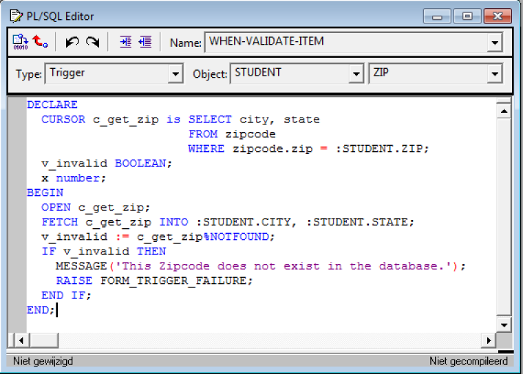

# Post Conversion Steps - Validation Trigger

In Oracle Form, when an item has a validation trigger, QAFE conversion tool converts them to different artifacts.




**The PL/SQL code will be converted to a stored-procedure**

For example::
```sql
  PROCEDURE STUDENT_ZIP_WVI(P_STUDENT INOUT QAFE_STUDENT, QAFE_BUILT_IN_LIST OUTVARCHAR2)
  IS
  BEGIN
  DECLARE
    CURSOR c_get_zip isSELECT city, state FROM zipcode WHERE zipcode.zip = P_STUDENT.ZIP;
      v_invalid BOOLEAN;
      x         NUMBER;
    BEGIN
      OPEN c_get_zip;
      FETCH c_get_zip INTO P_STUDENT.CITY, P_STUDENT.STATE;
    v_invalid := c_get_zip%NOTFOUND;
    IF v_invalid THEN
      MESSAGE('This Zipcode does not exist in the database.');
      RAISE FORM_TRIGGER_FAILURE;
      ENDIF;
    END;
    QAFE_BUILT_IN_LIST := QAFE_BUILT_IN.GET_QAFE_BUILT_IN_LIST;
    QAFE_BUILT_IN.CLEAR_DATA;
  END;
```
With the corresponding database object, like:
```xml
  CREATEORREPLACETYPE QAFE_ STUDENT AS OBJECT (
      STUDENT_ID NUMBER
    , SALUTATION VARCHAR2(5)
    , FIRST_NAME VARCHAR2(25)
    , LAST_NAME VARCHAR2(25)
    , PHONE VARCHAR2(15)
    , STREET_ADDRESS VARCHAR2(50)
    , ZIP VARCHAR2(5)
    , CITY VARCHAR2(30)
    , STATE VARCHAR2(30)
    , EMPLOYER VARCHAR2(50)
    , REGISTRATION_DATE DATE
    , CONSTRUCTOR FUNCTION QAFE_STUDENT RETURN SELF AS RESULT
  );
```

In order to run the generated ADF application properly with validation, some post-modifications should be made in the generated sql script, located in the scripts folder in the output:

1. Add the following column to all the generated database objects:

  ```sql
  MESSAGE VARCHAR2(1000);
  ```
2. Remove the QAFE_BUILT_IN_LIST argument in the header of all procedures, in declaration and body

3. Remove the following in the body of all procedures, if present:
```sql
QAFE_BUILT_IN_LIST := QAFE_BUILT_IN.GET_QAFE_BUILT_IN_LIST;  
QAFE_BUILT_IN.CLEAR_DATA;  
RAISE FORM_TRIGGER_FAILURE  
DO_KEY  
```
4. Modify the Message built-in in the body of all procedures, if present:
  ```sql
  MESSAGE(<text>); to <argument>.MESSAGE := <text>;
  ```
  Example:
  ```sql
  MESSAGE('This Zipcode does not exist in the database.');  
  to
  P_STUDENT.MESSAGE := 'This Zipcode does not exist in the database.';
  ```
